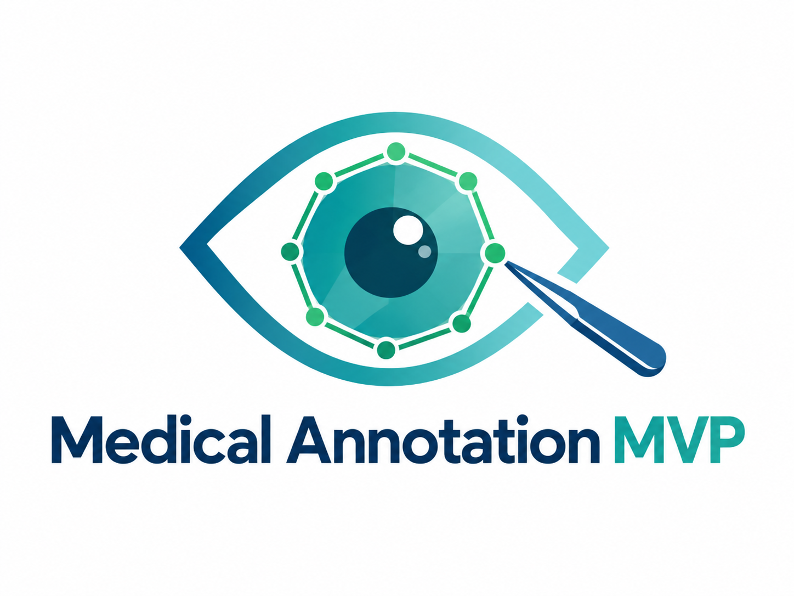

<p align="center">
  
</p>

<h1 align="center">Medical Annotation MVP</h1>

<p align="center">
  <strong>GPU-assisted annotation for medical images and surgical-video research.</strong>
</p>

## Product demo

All demonstrations below are included in this repository. Before publishing a fork or derivative, verify that the media contains no patient-identifying information and that you have permission to share it.

### AI-assisted image annotation

SAM 2 can generate and refine masks from point or box prompts, while the operator retains control over the final annotation.

<p align="center">
  
</p>

### Surgical-video research workflow

<table>
  <tr>
    <td width="50%" align="center">
      <strong>Surgical phase annotation</strong><br />
      
    </td>
    <td width="50%" align="center">
      <strong>Non-destructive video trimming</strong><br />
      
    </td>
  </tr>
  <tr>
    <td width="50%" align="center">
      <strong>Ultrasound-probe tracking</strong><br />
      
    </td>
    <td width="50%" align="center">
      <strong>Forceps tracking</strong><br />
      
    </td>
  </tr>
  <tr>
    <td colspan="2" align="center">
      <strong>OCT tracking</strong><br />
      
    </td>
  </tr>
</table>

<p align="center">
  <a href="#quick-start">Quick start</a> ·
  <a href="#product-demo">Product demo</a> ·
  <a href="#features-at-a-glance">Features</a> ·
  <a href="#deployment-at-a-glance">Deployment</a> ·
  <a href="#research-scope-and-data-safety">Data safety</a>
</p>

> **Research software.** This project supports research data preparation and annotation workflows. It is not medical advice, a diagnostic device, or a clinical decision-support system.

## Overview

Medical Annotation MVP brings image annotation, surgical-video curation, AI-assisted segmentation, and research-oriented export into one self-hosted workspace. It is designed for teams that need an auditable path from raw media to reusable annotation datasets without moving data to a public cloud.

The project follows the practical conventions common in mature annotation ecosystems: a clear product entry point, focused demonstrations, reproducible local deployment, explicit data boundaries, and exportable results. The interface currently supports Chinese and English.

### What it is for

- Annotating images or extracted video frames with polygons and rectangles.
- Refining regions with SAM 2 point- and box-prompted segmentation.
- Managing surgical-video footage, frame extraction, non-destructive trims, notes, and provenance.
- Recording surgical phases and research skill-assessment metadata.
- Exporting LabelMe-compatible annotations, masks, overlays, and phase data.

### System architecture

```text
Browser (Vue 3 + TypeScript)
            │
            ▼
FastAPI service ───── PostgreSQL metadata
     │       │
     │       ├──── Local media / annotation storage
     │       ├──── FFmpeg / ffprobe video processing
     │       └──── SAM 2 GPU inference
     ▼
Export: LabelMe JSON · masks · overlays · phase records
```

## Features at a glance

| Area | Included capabilities |
| --- | --- |
| Dataset management | Projects, tasks, labels, image batches, and local media storage. |
| Manual annotation | Polygon and rectangle tools, label-specific colors, undo/reset, and per-image navigation. |
| SAM 2 assistance | Point and box prompts, multimask candidates, refinement, polygon simplification, and edge-aware cleanup. |
| Surgical video | Video upload/import, thumbnails, extracted frames, browser preview, provenance, notes, visibility controls, and non-destructive clips. |
| Research records | Surgical phase annotation and skill-assessment support for research workflows. |
| Export | LabelMe JSON, binary masks, visual overlays, phase annotations, and project artifacts. |
| Local deployment | Self-hosted Vue frontend, FastAPI backend, PostgreSQL metadata store, local file storage, and optional CUDA inference. |
| Internationalization | Chinese and English user interface. |

## Quick start

The preferred setup runs PostgreSQL and the frontend through Docker Compose, while the FastAPI service runs on the host so it can access the GPU and local SAM 2 installation.

```bash
git clone https://github.com/Trripy/medical-annotation-mvp.git
cd medical-annotation-mvp
cp .env.example .env

# Start PostgreSQL. The default host port is 5433.
docker compose up -d db
```

Create a Python environment, install backend dependencies, and install SAM 2 according to its upstream instructions. Then update `.env` so `CONDA_ENV`, `SAM2_REPO_ROOT`, `SAM2_CHECKPOINT`, and `SAM2_DEVICE` match the machine.

```bash
# Linux host backend
./scripts/start_backend_host.sh

# Separate terminal: start frontend container
./scripts/start_frontend.sh
```

Open `http://localhost:5173`. The frontend calls the backend on the current browser host at port `8000` unless `VITE_API_BASE_URL` is configured.

### Windows workstation

The platform can also run on Windows. Use PowerShell or Git Bash, install Docker Desktop if using the bundled PostgreSQL service, and set Windows-style paths in environment variables where needed. GPU-based SAM 2 requires a compatible CUDA/PyTorch installation; CPU execution is possible but substantially slower.

```powershell
Copy-Item .env.example .env
docker compose up -d db

python -m venv .venv
.\.venv\Scripts\Activate.ps1
pip install -r .\backend\requirements.txt

cd .\frontend
npm install
npm run dev -- --host 127.0.0.1 --port 5173
```

In another PowerShell window, set `SAM2_REPO_ROOT` and other required variables from `.env`, then start the API:

```powershell
$env:PYTHONPATH = "$PWD\backend;$env:SAM2_REPO_ROOT"
python -m alembic -c .\backend\alembic.ini upgrade head
python -m uvicorn app.main:app --app-dir .\backend --host 127.0.0.1 --port 8000
```

## Deployment at a glance

| Requirement | Recommendation |
| --- | --- |
| GPU inference | Linux with NVIDIA GPU and a compatible CUDA/PyTorch stack is recommended. |
| Database | PostgreSQL 16 via the supplied `docker-compose.yml`; default host port is `5433`. |
| Video tools | Install `ffmpeg` and `ffprobe` for research-video trimming. |
| Model files | Keep the SAM 2 repository and checkpoint outside Git; configure their local paths in `.env`. |
| Network exposure | Restrict CORS, use authentication and TLS, set a strong database password, and take verified backups. |

Copy `.env.example` to `.env`; it documents the available database, storage, SAM 2, FFmpeg, and server-side import settings. The following commands validate a running installation:

```bash
curl http://127.0.0.1:8000/api/v1/health
curl http://127.0.0.1:8000/api/v1/sam2/health
```

The SAM 2 health endpoint will report unavailable if the model repository, checkpoint, GPU runtime, or model load is not ready. Manual annotation and non-SAM workflows can still be assessed independently.

## Typical workflow

1. Create a project and define labels, shape types, and colors.
2. Upload images or ingest approved research video.
3. Annotate manually or use SAM 2 prompts to propose masks.
4. Review and refine the result at image/frame level.
5. Add phases, notes, clips, and skill-assessment data as needed.
6. Export the required research artifacts.

## Development and releases

```bash
# Backend tests
cd backend
pytest -q

# Frontend checks and build
cd ../frontend
npm install
npm run build
```

The root [VERSION](./VERSION) file is the authoritative repository version. The release workflow checks that it is valid SemVer and has a corresponding entry in [CHANGELOG.md](./CHANGELOG.md). Before a production update, review [docs/RELEASE.md](./docs/RELEASE.md).

## Research scope and data safety

- Keep clinical identifiers, credentials, database dumps, private checkpoints, and raw patient media out of Git.
- Confirm that all demo assets and exported datasets are de-identified and authorized for their intended audience.
- Back up the PostgreSQL database and `LOCAL_STORAGE_ROOT` together; metadata without media, or media without metadata, is incomplete.
- This software assists data preparation. Final annotations remain the responsibility of qualified researchers and reviewers.
- Validate any deployment against the governance, privacy, security, and regulatory requirements of your institution before processing real clinical data.

## Detailed reference

<details>
<summary>Expand the original detailed feature, configuration, deployment, testing, and contribution guide.</summary>

# Medical Annotation MVP

**A GPU-assisted annotation platform for medical images and surgical videos.**

Medical Annotation MVP is a self-hosted research annotation platform built for medical imaging and surgical video datasets. It combines conventional manual annotation tools with **SAM 2-assisted segmentation**, research video management, surgical phase annotation, skill assessment, and structured dataset export.

The project is designed for research workflows where data needs to remain on local or institutional infrastructure.

> **Status:** Research software / MVP. It is not a clinically validated medical device or a production-ready clinical system.

---

## Highlights

* **Image & frame annotation** — rectangle, polygon, editing, layer ordering, review workflows, and configurable labels.
* **SAM 2-assisted segmentation** — point/box prompting, multiple mask candidates, refinement, edge snapping, and mask post-processing.
* **Surgical video workflows** — upload or server-side import, frame extraction, thumbnails, trimming, notes, provenance, and visibility management.
* **Phase annotation** — timeline-based surgical phase labeling with draft/submitted versions, gap handling, validation, and label mapping.
* **Skill assessment** — rubric-based surgical skill scoring with criteria, evidence, validation, and submission.
* **Research-ready exports** — LabelMe, overlay, indexed/color masks, phase JSON, mapped labels, and multi-video batch export.
* **Bilingual interface** — Simplified Chinese and English.
* **Self-hosted storage** — PostgreSQL for structured data and local filesystem storage for images, videos, frames, and exports.

---

## Tech Stack

| Layer              | Technology                                   |
| ------------------ | -------------------------------------------- |
| Frontend           | Vue 3, TypeScript, Vite, Element Plus, Pinia |
| Backend            | FastAPI, SQLAlchemy, Pydantic                |
| Database           | PostgreSQL + Alembic                         |
| AI                 | PyTorch, CUDA, SAM 2                         |
| Media              | OpenCV, FFmpeg / ffprobe                     |
| Storage            | Local filesystem                             |
| Linux deployment   | Docker Compose + host GPU backend            |
| Windows deployment | Native PostgreSQL + Conda/Python + Node.js   |

---

## Architecture

```text
                         Browser
                            │
                     Vue Frontend
                            │
                     FastAPI Backend
                  ┌─────────┼─────────┐
                  │         │         │
             PostgreSQL   Storage   FFmpeg
                                      │
                               PyTorch / SAM 2
                                      │
                                   NVIDIA GPU
```

The backend intentionally runs outside the frontend container in the current GPU deployment so that it can directly access CUDA, SAM 2 checkpoints, FFmpeg, and local research data.

---

# Getting Started

The project currently supports two deployment paths:

* **Linux GPU server** — recommended for shared laboratory servers.
* **Native Windows** — supported for standalone Windows GPU workstations without WSL.

---

## Linux

### Requirements

* Linux
* Docker + Docker Compose
* Python / Conda
* NVIDIA driver and CUDA-capable GPU
* SAM 2 repository and checkpoint
* FFmpeg / ffprobe

Clone the repository:

```bash
git clone https://github.com/Trripy/medical-annotation-mvp.git
cd medical-annotation-mvp
```

Create the environment:

```bash
conda create -n med-annotate python=3.10 -y
conda activate med-annotate

pip install -r backend/requirements.txt
```

Clone and install SAM 2:

```bash
cd ..
git clone https://github.com/facebookresearch/sam2.git
cd sam2
pip install -e .
```

Download a SAM 2.1 checkpoint, for example:

```text
sam2/checkpoints/sam2.1_hiera_large.pt
```

Create the application configuration:

```bash
cd ../medical-annotation-mvp
cp .env.example .env
```

Configure at least:

```env
POSTGRES_DB=med_annotate
POSTGRES_USER=med_annotate
POSTGRES_PASSWORD=med_annotate
POSTGRES_HOST=127.0.0.1
POSTGRES_PORT=5433

LOCAL_STORAGE_ROOT=/path/to/medical-annotation-data

SAM2_REPO_ROOT=/path/to/sam2
SAM2_CHECKPOINT=/path/to/sam2/checkpoints/sam2.1_hiera_large.pt
SAM2_DEVICE=cuda

RESEARCH_VIDEO_FFMPEG_BINARY=/usr/bin/ffmpeg
```

Start the backend:

```bash
CONDA_ENV="$CONDA_PREFIX" \
SAM2_REPO_ROOT=/path/to/sam2 \
SAM2_CHECKPOINT=/path/to/sam2/checkpoints/sam2.1_hiera_large.pt \
./scripts/start_backend_gpu.sh
```

Start the frontend:

```bash
docker compose up -d frontend
```

Open:

```text
http://localhost:5173
```

API documentation:

```text
http://localhost:8000/docs
```

---

# Native Windows

The full application can also run directly on Windows without WSL or Docker.

The native Windows stack is:

```text
PostgreSQL Windows Service
        +
Conda / Python Backend
        +
PyTorch CUDA
        +
SAM 2
        +
FFmpeg
        +
Node.js Frontend
```

> SAM 2 upstream recommends WSL for Windows users. Native Windows therefore requires a little more setup. The SAM 2 CUDA extension can be skipped if it cannot be compiled; PyTorch CUDA inference can still use the NVIDIA GPU. SAM 2 explicitly supports disabling the optional extension with `SAM2_BUILD_CUDA=0`.

### Requirements

Install:

* Git for Windows
* Miniconda or Anaconda
* PostgreSQL 16
* Node.js
* FFmpeg
* NVIDIA GPU driver
* Microsoft Visual C++ Redistributable

Verify the GPU first:

```powershell
nvidia-smi
```

---

## 1. Clone the repository

A short path is recommended:

```powershell
cd D:\Projects

git clone https://github.com/Trripy/medical-annotation-mvp.git

cd medical-annotation-mvp
```

---

## 2. Create the Python environment

```powershell
conda create -n med-annotate python=3.10 -y
conda activate med-annotate

python -m pip install --upgrade pip

pip install -r backend\requirements.txt
```

Verify PyTorch:

```powershell
python -c "import torch; print(torch.__version__); print(torch.version.cuda); print(torch.cuda.is_available()); print(torch.cuda.get_device_name(0) if torch.cuda.is_available() else 'No GPU')"
```

A working GPU environment should report:

```text
True
```

for:

```python
torch.cuda.is_available()
```

---

## 3. Install SAM 2

For example:

```powershell
cd D:\AI

git clone https://github.com/facebookresearch/sam2.git

cd sam2
```

Native Windows installations can skip the optional SAM 2 CUDA extension:

```powershell
$env:SAM2_BUILD_CUDA="0"

pip install --no-build-isolation -e .

Remove-Item Env:SAM2_BUILD_CUDA
```

Verify:

```powershell
python -c "import sam2; print('SAM2 OK')"
```

Download a checkpoint such as:

```text
sam2.1_hiera_large.pt
```

and place it at:

```text
D:\AI\sam2\checkpoints\sam2.1_hiera_large.pt
```

---

## 4. Configure PostgreSQL

Install PostgreSQL 16 and keep the default Windows service running.

Create the application user and database:

```sql
CREATE USER med_annotate WITH PASSWORD 'med_annotate';
CREATE DATABASE med_annotate OWNER med_annotate;
```

A typical native Windows PostgreSQL configuration uses:

```text
127.0.0.1:5432
```

---

## 5. Install FFmpeg

Install a Windows FFmpeg build containing:

```text
ffmpeg.exe
ffprobe.exe
```

For example:

```text
D:\Tools\ffmpeg\bin\ffmpeg.exe
D:\Tools\ffmpeg\bin\ffprobe.exe
```

Add the directory to `PATH` or configure it explicitly.

Verify:

```powershell
ffmpeg -version
ffprobe -version
```

The build must provide a browser-compatible H.264 encoder such as:

```text
libx264
```

or:

```text
libopenh264
```

---

## 6. Configure the backend

Because the backend loads `.env` from its working directory, the most direct native Windows setup is:

```text
medical-annotation-mvp\backend\.env
```

Create it from the repository example:

```powershell
Copy-Item .env.example backend\.env
```

Example:

```env
POSTGRES_DB=med_annotate
POSTGRES_USER=med_annotate
POSTGRES_PASSWORD=med_annotate
POSTGRES_HOST=127.0.0.1
POSTGRES_PORT=5432

BACKEND_CORS_ORIGINS=http://127.0.0.1:5173,http://localhost:5173

LOCAL_STORAGE_ROOT=D:/MedicalAnnotationData/storage

SAM2_REPO_ROOT=D:/AI/sam2
SAM2_CHECKPOINT=D:/AI/sam2/checkpoints/sam2.1_hiera_large.pt
SAM2_MODEL_CFG=configs/sam2.1/sam2.1_hiera_l.yaml
SAM2_DEVICE=cuda
SAM2_LOAD_ON_STARTUP=true

RESEARCH_VIDEO_FFMPEG_BINARY=D:/Tools/ffmpeg/bin/ffmpeg.exe
RESEARCH_VIDEO_TRIM_MAX_CONCURRENCY=1
```

Windows paths using `/` are recommended in `.env` files.

For server-side video import, add for example:

```env
RESEARCH_VIDEO_IMPORT_ROOTS={"dataset":"D:/CataractVideos"}
```

Only explicitly configured directories are available through server-side import.

---

## 7. Initialize the database

```powershell
conda activate med-annotate

cd D:\Projects\medical-annotation-mvp\backend

alembic upgrade head
```

Check the migration state:

```powershell
alembic current
alembic heads
```

They should point to the same revision.

---

## 8. Start the backend

From the `backend` directory:

```powershell
conda activate med-annotate

python -m uvicorn app.main:app `
  --host 127.0.0.1 `
  --port 8000
```

Verify:

```text
http://127.0.0.1:8000/docs
```

or:

```powershell
Invoke-WebRequest http://127.0.0.1:8000/api/v1/health
```

Keep this PowerShell window running.

---

## 9. Build and start the frontend

Open a second PowerShell window:

```powershell
cd D:\Projects\medical-annotation-mvp\frontend

npm install
npm run build
node server.mjs
```

The frontend starts on:

```text
http://127.0.0.1:5173
```

Open that URL in Chrome or Microsoft Edge.

---

## 10. Daily Windows startup

After the initial installation, PostgreSQL normally runs automatically as a Windows Service.

Start the backend:

```powershell
conda activate med-annotate
cd D:\Projects\medical-annotation-mvp\backend

python -m uvicorn app.main:app `
  --host 127.0.0.1 `
  --port 8000
```

Start the frontend in another terminal:

```powershell
cd D:\Projects\medical-annotation-mvp\frontend
node server.mjs
```

Then open:

```text
http://127.0.0.1:5173
```

Use `Ctrl+C` in both terminals to stop the application.

---

# Configuration

Common environment variables:

| Variable                              | Description                               |
| ------------------------------------- | ----------------------------------------- |
| `POSTGRES_*`                          | PostgreSQL connection                     |
| `LOCAL_STORAGE_ROOT`                  | Managed image/video/export storage        |
| `SAM2_REPO_ROOT`                      | Local SAM 2 repository                    |
| `SAM2_CHECKPOINT`                     | Default SAM 2 checkpoint                  |
| `SAM2_DEVICE`                         | `cuda`, `cpu`, or `auto`                  |
| `RESEARCH_VIDEO_IMPORT_ROOTS`         | Whitelisted server-side video directories |
| `RESEARCH_VIDEO_FFMPEG_BINARY`        | FFmpeg executable                         |
| `RESEARCH_VIDEO_TRIM_MAX_CONCURRENCY` | Maximum simultaneous video trims          |
| `BACKEND_CORS_ORIGINS`                | Allowed frontend origins                  |

See `.env.example` for the complete set of runtime options.

---

# Typical Workflow

```text
Import images / videos
        ↓
Create labels / protocols
        ↓
Annotate
 ┌──────┼──────────┐
 │      │          │
Frame  Phase      Skill
 │      │          │
 └──────┼──────────┘
        ↓
Review / Validate
        ↓
Submit
        ↓
Export
```

Research videos can also be trimmed before annotation while preserving the relationship to their original source video.

---

# Development

## Releases and Production Updates

The root `VERSION` file is the application version and formal release tags use the matching `vMAJOR.MINOR.PATCH` form. Production updates are intentionally explicit: see [docs/RELEASE.md](docs/RELEASE.md) and `scripts/release/` for the required precheck, verified PostgreSQL backup, deployment, and smoke-test workflow. A verified database backup is mandatory before a production database migration.

## Backend

```bash
cd backend

python -m pip install -r requirements.txt

alembic upgrade head

python -m uvicorn app.main:app \
  --reload \
  --host 127.0.0.1 \
  --port 8000
```

OpenAPI documentation is available at:

```text
http://localhost:8000/docs
```

---

## Frontend

```bash
cd frontend

npm install
npm run dev
```

Production build:

```bash
npm run build
```

---

# Testing

Backend:

```bash
cd backend
python -m pytest tests -q
```

Frontend:

```bash
cd frontend
node --test tests/*.test.ts
```

Type checking:

```bash
npx vue-tsc -b --pretty false
```

Build verification:

```bash
npm run build
```

Repository patch check:

```bash
git diff --check
```

---

# Data Storage

Runtime data is intentionally kept outside Git.

Typical runtime data includes:

```text
storage/
├── uploaded images
├── research videos
├── extracted frames
├── thumbnails
└── exports
```

The PostgreSQL database stores structured application and annotation metadata.

Do **not** commit:

* patient data or PHI
* clinical videos
* local `.env` files
* passwords or tokens
* SAM 2 checkpoints
* PostgreSQL data
* runtime storage
* generated exports

For important datasets, back up both **PostgreSQL and `LOCAL_STORAGE_ROOT`**.

---

# Security

This repository is currently intended for research and controlled institutional environments.

Before exposing the application to untrusted networks or using it as a production service, review at least:

* authentication and authorization
* HTTPS
* CORS restrictions
* database and storage backups
* access logging and auditing
* secret management
* data retention
* PHI protection
* disaster recovery

For local Windows use, the examples intentionally bind FastAPI and the frontend to:

```text
127.0.0.1
```

instead of exposing them to the LAN.

---

# Project Status

The platform is actively evolving around medical and surgical video research workflows.

Current limitations include:

* SAM 2 native Windows support is less mature than Linux and requires environment-specific validation.
* Long video import and trimming operations can be resource intensive.
* Extracted frames and research videos can consume substantial disk space.
* The current platform is research software and has not undergone clinical validation or production security certification.

---

# Contributing

Issues, bug reports, feature proposals, and pull requests are welcome.

Before submitting changes:

```bash
git diff --check
```

and run the relevant backend/frontend test suites.

Please do not include patient data, private datasets, credentials, or model checkpoints in issues or pull requests.

---

# License

This repository does not currently include a project `LICENSE`.

Before public redistribution or formal open-source release, select an appropriate project license and review the licenses of bundled or required third-party components, including SAM 2, PyTorch, FFmpeg, PostgreSQL, Vue, and other dependencies.

</details>
